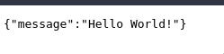
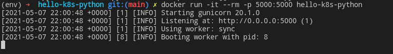
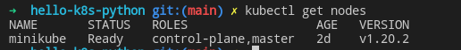
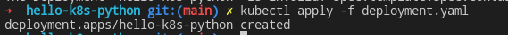
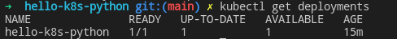
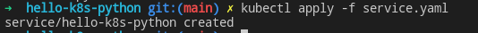
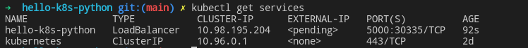
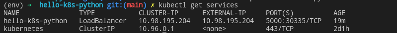
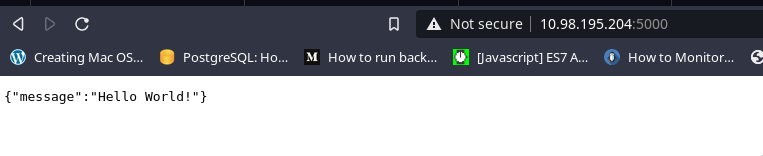

# hello-k8s-python

Aplicacion web creada en Flask Python deployada con k8s en GNU/Linux basado en la primera charla de la [Comunidad Kubernetes Latam](https://t.me/kubernetesCol)

## Aplicacion

La aplicacion esta hecha con Python 3.x y Flask es muy sencilla retorna un json de prueba a `/`

Todas las dependencias se encuentran en `requirements.txt`
para instalar las dependencias:

    $ pip install -r requirements.txt

## Contenerizacion

Para contenerizar la aplicacion es necesario:
    
- Tener instalado [Docker](https://docs.docker.com/engine/install/)
- Tener levantado el servicio de Docker 
    - `systemctl start docker.service` o `service docker start`
- Ojo con los [post-instalation steps](https://docs.docker.com/engine/install/linux-postinstall/) para poder usar docker sin superusuario.

La creacion del Dockerfile puede ser manual o en su defecto se puede usar la extension [Docker](https://marketplace.visualstudio.com/items?itemName=ms-azuretools.vscode-docker) de [VSCode](https://code.visualstudio.com/)

Presionando `Crtl+Shift+P` escribimos Dockerfile y llenamos los datos requeridos.

Para crear la imagen ejecutamos:

    $ docker build -t <image_name>

Ej:

    $ docker build -t hello-k8s-python

Para correr nuestra imagen recien creada ejecutamos:

    $ docker run -it --rm -p <host_port>:<image_port> <image_name>

Ej:

    $ docker run -it --rm -p 5000:5000 hello-k8s-python

Para subir la imagen a [Docker Hub](https://hub.docker.com/) es necesairo crear un repositorio e inicida sesion en el equipo

    $ docker login --username=<docker_id>

Luego tageamos la imagen en base al repo que hemos creado en Docker Hub

    $  docker tag <local_image>:<tag_name> <docker_id>]/<repo_name>:<tag_name>

Ej:

    $ docker tag hello-k8s-python:latest is1394/hello-k8s-python:latest

Finalmente subimos la imagen:

    $ docker push <docker_id>/<repo_name>:<tag_name>

Ej:

    $ docker push is1394/hello-k8s-python:latest   

## Cluster K8s

Para configurar el cluster con la imagen creada, verificar tener instalado [Kubernetes](https://kubernetes.io/docs/tasks/tools/install-kubectl-linux/), ademas de [Minikube](https://minikube.sigs.k8s.io/docs/start/)

Es necesario levantar Minikube, para esto ejecutamos:

    $ minikube start

Podemos indicar el [driver](https://minikube.sigs.k8s.io/docs/drivers/) que prefiramos para minikube, por facilidad se escogio el driver de Docker

    $ minikube start --driver=docker 
    $ minikube config set driver docker

Verificamos que nuestro cluster este levantado, ejecutando:

    $ kubectl get notes

Ahora es necesario crear las configuraciones de k8s para que nuestro proyecto pueda arrancar,por facilidad usaremos la extension de [Kubernetes Snippets](https://marketplace.visualstudio.com/items?itemName=doggy8088.k8s-snippets) 

Creamos un archivo `deployment.yaml` escribimos `k-deployment` y escogemos el snippet de k8s Deployment de la extension, colocamos un nombre a la aplicacion, en el apartado de `container` seteamos la imagen dentro de `image` y seteamos el `containerPort` dentro del apartado de `ports`

Ahora es necesario crear un servicio, para esto creamos el archivo `service.yaml` escribimos `k-service` y escogemos el snippet de k8s Service de la extension, colocamos el nombre de la aplicacion que escribimos en el `deployment.yaml`, seteamos los puertos correspondientes y cambiamos el tipo de servicio a `LoadBalancer`.

Indicamos a k8s que aplique la configuracion que hemos creado ejecutando:

    $ kubectl apply -f deployment.yaml

Verificamos los deployments de nuestro k8s:

    $ kubectl get deployments

Aplicamos el servicio como el deployment

    $ kubectl apply -f service.yaml

Verificamos los services de nuestro k8s:

    $ kubectl get services

Podemos observar que la salida nos dice que nuestra app esta como `pending` en el apartado de `EXTERNAL-IP` por lo cual para solucionar esto necesitamos crear un tunnel con minukube por el tipo de servicio que estamos usando, ejecutamos:

    $ minikube tunnel

Volvemos a verificar los servicios

Observamos que se ha asignado el `EXTERNAL-IP`, ingresamos esa ip en nuestro navegador y Listo!

